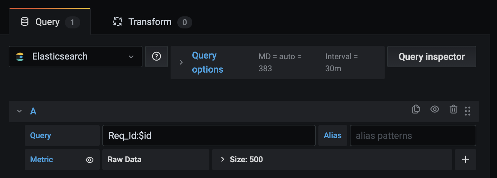
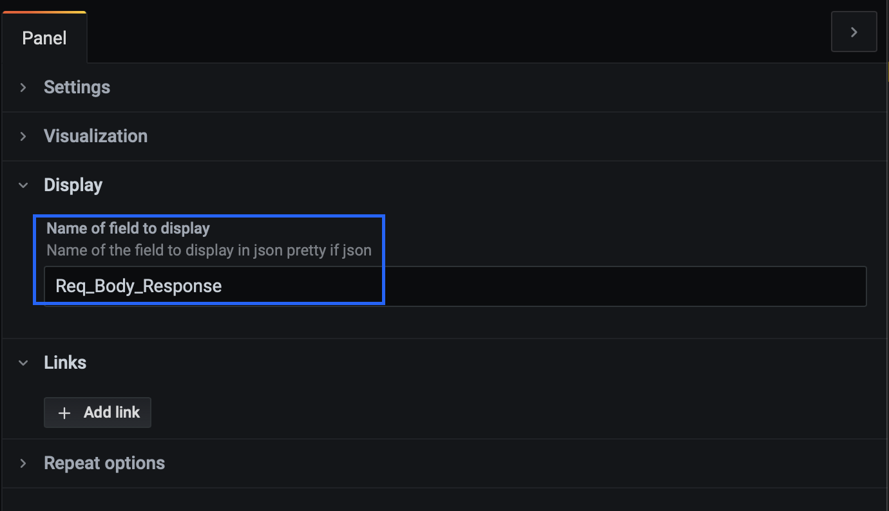
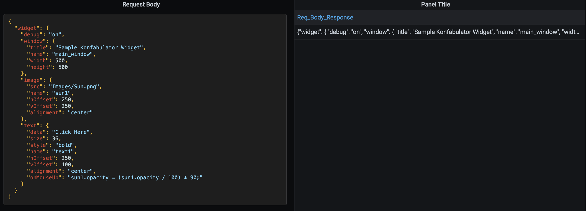

# JSON Formatter Panel

The **JSON Formatter Panel** allows you to display JSON field from an Elasticsearch document on a dashboard as pretty JSON.

It also works with a non-json field, the panel displays it in string format.

This panel requires configuring the name of the field to be displayed in Panel/Display under `Name of field to display`

*Exemple of Elasticsearch query*
  

*Panel configuration under Panel/Display*
  

*Exemple of json field display in the panel vs table panel*
  
